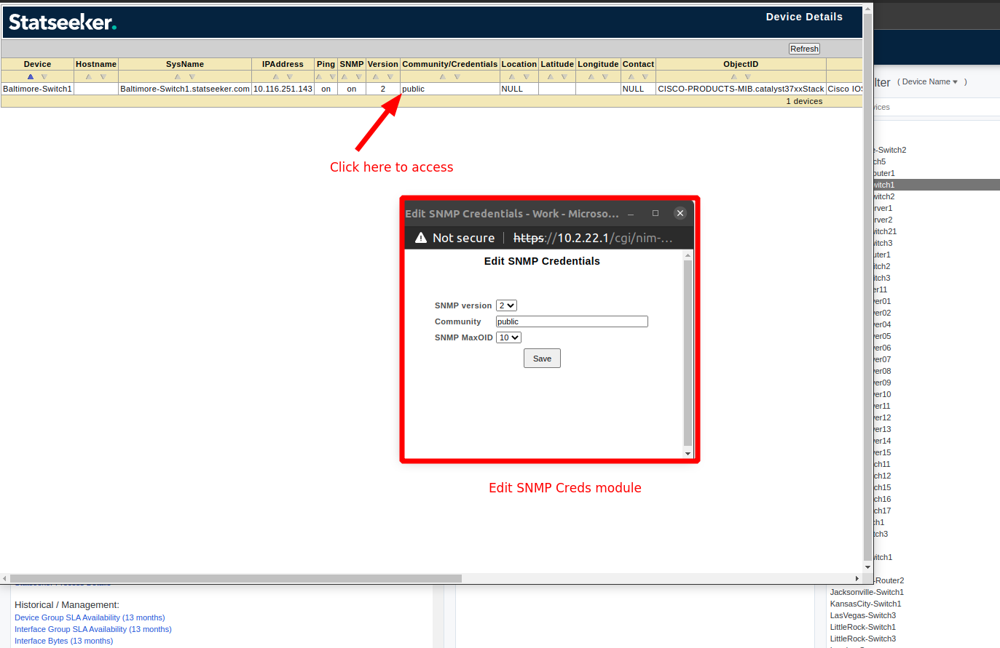

# NIM/Edit-SNMP-creds

This module displays a form to edit the SNMP credentials

☝️ **Notes**: 

This is a pilot module, converting a legacy page into an actual module.

It can be greatly optimised, but the first goal of this module is to prove the concept of organising our code in 'self-contained' modules, managed with Nx.

For example, the form could be extracted from this module since it is reused at multiple places around the application.

## Screenshot

